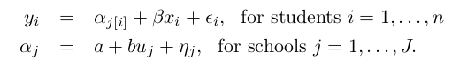
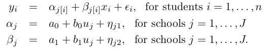

# Data analysis using regression and multilevel models

## Chapter 1

The feature that distinguishes multilevel model from classical regression is IN THE MODELING OF THE VARIATION BETWEEN GROUPS

### Varying-intercept model

### Varying intercept and slope model

## Chapter 2

The basic way that distribution are used in statistical modeling:

1) Start by fitting a distribution to the data y
2) Get predictors X 
3) Model y|X with error e

Further info in X can change yje distribution of e's (typically by reducing the variance) 

Distributions are often thought of as data summaries, but in the regression context they are more commonly applied to e's 

## Chapter 3

Residual standard deviation can be seen as a measure of the average distance each observation falls from its predictions from the model. For example is the residual standard deviation is equal to 18, this means that the linear model can predict the response variable to an accuracy of 18 points. 